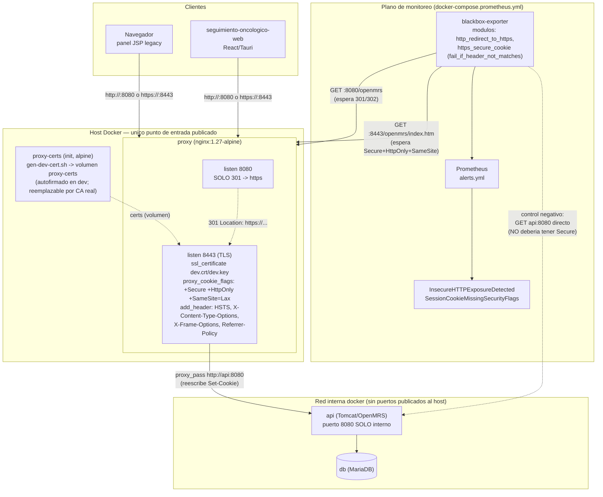

# Arquitectura del stack de seguridad del proxy TLS

> Documenta el wrapper de infraestructura (`docker-compose.proxy.yml` + monitoreo) agregado en
> agosto 2026 para cerrar dos riesgos que `openmrs-module-seguimientooncologico/docs/seguridad.md`
> §3 aceptaba como "fuera del control del módulo": HTTP sin TLS y cookie de sesión sin
> `Secure`/`SameSite` garantizados. Actualizar este documento cada vez que cambie la topología del
> proxy o las alertas asociadas — es la fuente de verdad de "qué protege esta capa, cómo, y cómo se
> verifica que lo sigue haciendo".

## 1. Por qué existe esta capa

Auditando la configuración real de Tomcat en este repo se encontraron dos huecos:

- `webapp/src/main/webapp/META-INF/context.xml` trae `useHttpOnly="false"`, que contradice el
  `http-only=true` que fija `web.xml` vía `<cookie-config>`. Hoy gana `web.xml` (mecanismo más
  específico), pero es una inconsistencia heredada de upstream, frágil ante cualquier cambio futuro
  de esos ficheros.
- Ningún fichero fija `SameSite` explícitamente. La protección CSRF que se documentaba dependía
  enteramente del *default del navegador* para cookies sin ese atributo (Chrome/Firefox/Edge tratan
  `SameSite` ausente como `Lax` desde ~2020) — no de una configuración activa de OpenMRS/Tomcat.
- El stack de desarrollo (`docker-compose.yml`) publicaba el backend directo en HTTP sin ningún
  proxy TLS delante.

Parchear `context.xml`/`web.xml` no era una opción robusta: son ficheros vendored del core, se
sobrescriben en cada sync con upstream, y ni siquiera es seguro que un cambio ahí tome efecto salvo
que `OMRS_BUILD=true` reconstruya el WAR desde este checkout (por defecto se usa la imagen ya
compilada). La solución adoptada mueve la garantía al **límite de red** en vez de al código: un
proxy nginx que reescribe lo que sale hacia el cliente, sin depender de que el core coopere.

## 2. Diagrama de arquitectura



## 3. Componentes y responsabilidad

| Componente | Responsabilidad de seguridad | Config |
| --- | --- | --- |
| `proxy` (nginx) | Único punto de entrada publicado al host. Redirige todo HTTP a HTTPS; termina TLS; fuerza `Secure`/`HttpOnly`/`SameSite=Lax` en cada `Set-Cookie` saliente; agrega headers `Strict-Transport-Security`, `X-Content-Type-Options`, `X-Frame-Options`, `Referrer-Policy` | `docker-compose.proxy.yml`, `monitoring/proxy/default.conf.template` |
| `proxy-certs` | Genera (una vez) el certificado TLS de desarrollo si no existe; no vuelve a correr si ya hay uno | `monitoring/proxy/gen-dev-cert.sh` |
| `api` | Ya NO publica su puerto HTTP al host — solo alcanzable dentro de la red docker (por el proxy o por otros servicios del stack, ej. blackbox-exporter) | `docker-compose.yml`, `docker-compose.override.yml` |
| `blackbox-exporter` | Prueba en vivo, no de forma estática, que el redirect y los flags de cookie siguen aplicando; además corre el control negativo contra `api` directo para demostrar que el chequeo detecta de verdad una condición insegura | `monitoring/prometheus/blackbox.yml` |
| `prometheus` | Evalúa `InsecureHTTPExposureDetected` y `SessionCookieMissingSecurityFlags` cada minuto sobre los resultados de los probes de arriba | `monitoring/prometheus/prometheus.yml`, `monitoring/prometheus/alerts.yml` |

## 4. Qué protege esto (y qué no)

**Sí resuelve:**

- Credenciales (Basic Auth) y cookie de sesión ya no viajan en texto plano fuera de `localhost` —
  el único camino publicado al host es HTTPS (el puerto HTTP solo redirige).
- La cookie de sesión trae `Secure`+`HttpOnly`+`SameSite=Lax` siempre, sin depender de que
  `context.xml`/`web.xml` del core estén bien configurados — la garantía vive en el límite de red,
  no en código que se pisa con cada sync de upstream.
- Headers de defensa en profundidad contra sniffing de MIME, clickjacking y filtración de
  `Referer` entre orígenes.

**No resuelve (limitaciones conocidas, documentadas a propósito en vez de dejarlas implícitas):**

- El certificado de desarrollo es autofirmado — el navegador/webview va a advertir la primera vez.
  Para un despliegue real, reemplazar el contenido del volumen `proxy-certs` por un certificado de
  una CA real (Let's Encrypt, CA corporativa) antes de exponer el stack fuera de `localhost`.
- La inconsistencia `useHttpOnly="false"` de `context.xml` sigue existiendo en el código del core
  — está neutralizada por el proxy, no corregida en la fuente. Si algún día se corre `api` sin este
  proxy delante (ver nota en `docker-compose.yml`), esa inconsistencia vuelve a quedar expuesta.
- El dashboard de JobRunr (puerto 9000, con contraseña `OMRS_EXTRA_JOBRUNR_DASHBOARD_PASSWORD`)
  sigue publicado en HTTP plano, sin pasar por este proxy — es la misma clase de riesgo que el
  backend de OpenMRS tenía antes de este cambio, pendiente como mejora futura si ese dashboard se
  usa fuera de `localhost`.
- No sustituye autenticación/autorización de aplicación: es una capa de transporte y de higiene de
  cookies, no reemplaza los chequeos de privilegio de `Context.hasPrivilege` que ya hace el módulo.

## 5. Cómo correrlo

```bash
docker compose -f docker-compose.yml -f docker-compose.override.yml -f docker-compose.proxy.yml up -d
# o, con monitoreo completo (Grafana + Prometheus + este proxy):
./start-stack.ps1
```

URLs resultantes (puertos por defecto, configurables en `.env` — ver `.env.example`):

- `http://localhost:8083/openmrs` → redirige a...
- `https://localhost:8446/openmrs` → panel real (aceptar la excepción del certificado autofirmado
  la primera vez).

## 6. Cómo se prueba

Dos capas complementarias, no redundantes:

1. **Continua (producción/staging):** las alertas de Prometheus `InsecureHTTPExposureDetected` y
   `SessionCookieMissingSecurityFlags` (§3) corren cada minuto contra el stack real y avisan si el
   wrapper deja de aplicar — por una reconfiguración accidental del proxy, por alguien reabriendo
   el puerto HTTP directo de `api`, o por un cambio en el core que rompa un supuesto.
2. **Bajo demanda (antes de un cambio, en CI, o para auditar):**
   `monitoring/proxy/test-proxy-security.sh` — smoke test que corre las mismas tres verificaciones
   (redirect, flags de cookie, headers) desde la línea de comandos contra un stack ya levantado, más
   una prueba negativa opcional (`--network`) que confirma que pegarle directo a `api` (bypaseando
   el proxy) **sí** carece de `Secure`/`SameSite` — es la evidencia de que el chequeo detecta una
   condición insegura de verdad, no solo que pasa en el caso feliz. Ver el script para el detalle de
   uso; se ejecuta con `bash` (Git Bash en Windows).

```bash
OMRS_HTTP_HOST_PORT=8083 OMRS_HTTPS_HOST_PORT=8446 \
  bash monitoring/proxy/test-proxy-security.sh --network openmrs-core_default
```

## 7. Runbook — si dispara una alerta

- **`InsecureHTTPExposureDetected`** (el puerto HTTP del proxy responde 200 en vez de redirigir):
  revisar que nadie haya cambiado `monitoring/proxy/default.conf.template` para servir contenido en
  el `server { listen 8080; }`, y que `api` siga sin publicar su puerto HTTP directo al host
  (`docker-compose.override.yml`/`docker-compose.yml` — buscar `ports:` bajo el servicio `api`).
- **`SessionCookieMissingSecurityFlags`** (el `Set-Cookie` por HTTPS ya no trae las tres flags):
  revisar `proxy_cookie_flags` en `default.conf.template` primero (¿se removió o se rompió al
  editar el template?); si el proxy está bien, correr
  `monitoring/proxy/test-proxy-security.sh --network ...` para confirmar si el problema está en el
  proxy o si cambió algo en el `cookie-config` del core que ahora requiere un ajuste distinto en
  `proxy_cookie_flags`.

## 8. Referencias

- `openmrs-module-seguimientooncologico/docs/seguridad.md` §3 — el análisis original que motivó
  este wrapper, y las políticas del módulo sobre no dejar un "riesgo aceptado" sin evaluar antes un
  wrapper + control de alerta.
- `README.md` §"Running with a TLS proxy" / §"Running with Prometheus" — cómo levantar cada overlay.
